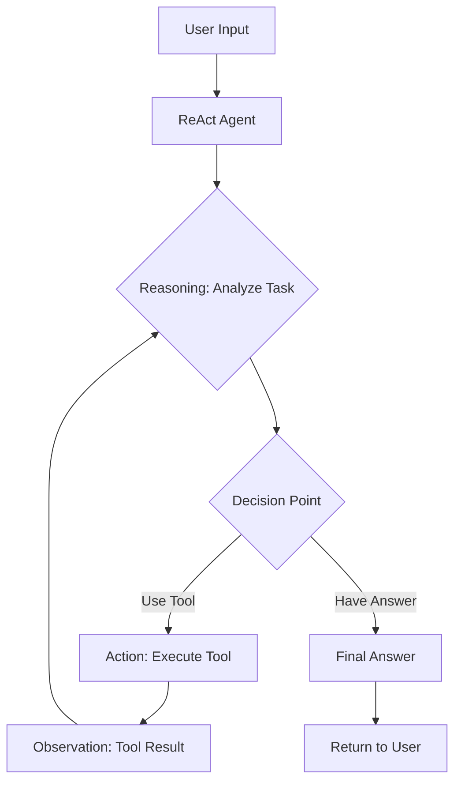
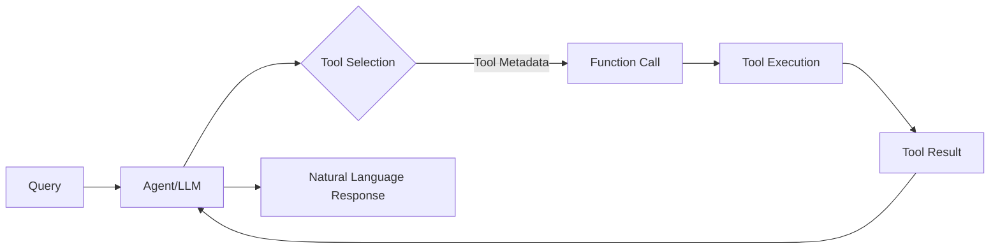
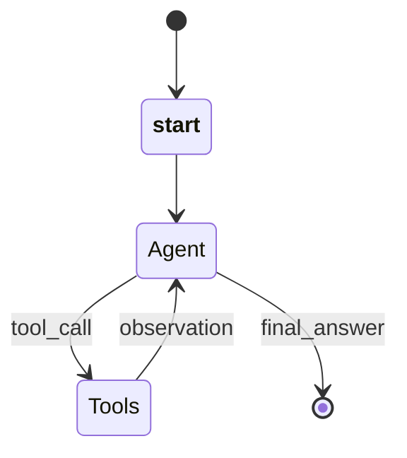

# Agent Orchestration Patterns

A comprehensive guide to modern AI agent orchestration patterns including ReAct, LangChain, CrewAI, and multi-agent workflows.

---

## Table of Contents

1. [ReAct Pattern (Reasoning + Acting)](#react-pattern-reasoning--acting)
2. [LangChain Agent Patterns](#langchain-agent-patterns)
3. [LangGraph State Machine Patterns](#langgraph-state-machine-patterns)
4. [CrewAI Orchestration Patterns](#crewai-orchestration-patterns)
5. [Multi-Agent Orchestration Patterns](#multi-agent-orchestration-patterns)
6. [Memory Management Patterns](#memory-management-patterns)
7. [Advanced Patterns](#advanced-patterns)
8. [Implementation Best Practices](#implementation-best-practices)

---

## ReAct Pattern (Reasoning + Acting)

### Overview

The **ReAct** (Reasoning and Acting) pattern is a foundational agent design pattern that combines an LLM's ability to reason with the capability to execute external tools. It implements a cycle where the agent alternates between thinking, acting, and observing.

### Core Concept

ReAct enables language models to generate both **verbal reasoning traces** and **task-specific actions** in an interleaved manner. The agent follows a continuous loop:

```
Goal → Thought → Action → Observation → Thought → ... → Final Answer
```

### Architecture Components

**Three Primary Components:**

1. **ReActState**: Maintains execution state including input, chat history, intermediate steps, and agent outcome
2. **ReActAgent**: Core class implementing the pattern with methods for reasoning, tool execution, and state transitions
3. **BaseAgent**: Abstract base class providing common agent functionality

### Execution Flow



**Step-by-Step Flow:**

1. **User provides input** to the ReAct Agent
2. **Agent examines input** and reasons about what to do (Thought)
3. **Agent decides** either to use a tool or provide a final answer
4. **If using a tool**, agent executes it and receives the result (Observation)
5. **Agent considers** the tool's result in the next thinking step
6. **Cycle continues** until the agent decides on a final answer
7. **Final answer** is returned to the user

### State Transitions

```
Initialized → Ready → Processing → Thinking → Tool Execution → (Loop back to Thinking) → Final Answer
```

**State Definitions:**

- **Initialized**: Agent created but not yet ready
- **Ready**: Agent ready to process input
- **Processing**: Agent actively working on the task
- **Thinking**: Agent reasoning about next steps
- **Tool Execution**: Agent using external tools
- **Final**: Agent has determined final answer

### Example Pattern

```
Thought: I should calculate the total.
Action: Calculator("123 + 456")
Observation: 579

Thought: Now I have the sum; next, I need to multiply it.
Action: Calculator("579 * 789")
Observation: 456,831

Thought: I have the final result.
Final Answer: 456,831
```

### Types of Reasoning Traces

ReAct supports various reasoning patterns:

- **Task Decomposition**: Breaking down goals to create action plans
- **Knowledge Injection**: Adding relevant commonsense knowledge
- **Information Extraction**: Extracting important parts from observations
- **Progress Tracking**: Maintaining plan execution while tracking task progress
- **Exception Handling**: Adjusting action plans when errors occur

### ReAct vs Traditional ReWoo

**ReAct (Default):**
- Sequential, step-by-step reasoning and action
- Each action depends on previous observation
- High transparency, clear decision traces
- May introduce latency with complex plans

**ReWoo (Alternative):**
- Plans multiple steps upfront
- Can execute actions in parallel where possible
- Reduced model invocations
- Better for high-volume workflows requiring speed

### Use Cases

- **Question Answering**: Queries requiring factual information lookup
- **Task Automation**: Multi-step tasks requiring reasoning and tool use
- **Information Gathering**: Collecting data from multiple sources
- **Decision Making**: Situations requiring both analysis and action
- **Interactive Assistance**: Multi-step task completion with user guidance

### Implementation Example

```python
from agent_patterns.patterns import ReActAgent
from agent_patterns.core.tools import ToolRegistry
from langchain.tools import tool

# Define tools
@tool
def search(query: str) -> str:
    """Search for information about a topic."""
    return f"Results for {query}: Some relevant information..."

# Create tool registry
tool_registry = ToolRegistry([search])

# Configure LLM
llm_configs = {
    "default": {
        "provider": "openai",
        "model": "gpt-4o",
        "temperature": 0.7
    }
}

# Initialize ReAct agent
agent = ReActAgent(
    llm_configs=llm_configs,
    tool_provider=tool_registry
)

# Run agent
result = agent.run("What is the capital of France and its population?")
```

### Best Practices

- Keep tool descriptions clear and specific
- Set appropriate `max_steps` to prevent infinite loops
- Use memory for complex or multi-turn interactions
- Structure prompts to encourage step-by-step reasoning
- Handle tool execution errors gracefully
- Add comprehensive logging for transparency

---

## LangChain Agent Patterns

### LangChain Expression Language (LCEL)

**LCEL** is a declarative approach to building agents that describes **what** to do rather than **how** to do it, enabling LangChain to optimize run-time execution.

### Core Architecture

```python
# Basic LCEL chain structure
agent = prompt | llm | output_parser
```

**Key Components:**

1. **Runnables**: Core abstraction implementing a standard interface
2. **RunnableSequence**: Sequential composition of operations
3. **RunnableParallel**: Parallel execution of multiple runnables
4. **RunnablePassthrough**: Pass data through while optionally transforming it

### LCEL Benefits

- **Optimized Parallel Execution**: Run multiple operations concurrently
- **Simplified Streaming**: Incremental output with minimal time-to-first-token
- **Seamless LangSmith Tracing**: Automatic logging for observability
- **Standard API**: Consistent interface across all chains
- **Deployable with LangServe**: Production-ready deployment

### Agent Types in LangChain (2025)

**Modern LangChain architecture uses specialized agent types:**

1. **Planner Agent**: Strategic brain breaking down goals into subtasks
2. **Executor Agents**: Carry out specific subtasks (RAG Executor, Code Generator, Translator)
3. **Communicator Agent**: Ensures smooth handoff between agents
4. **Evaluator Agent**: Quality assurance on outputs, can reroute if needed

### Agent Architecture Diagram

```
┌─────────────────────────────────────────────────────────┐
│                   Orchestration Layer                    │
│  (MultiAgentExecutor / LangGraph / LCEL Runtime)        │
└───────────────┬─────────────────────────────────────────┘
                │
    ┌───────────┴───────────┬───────────────┬──────────────┐
    ▼                       ▼               ▼              ▼
┌─────────┐          ┌──────────┐    ┌──────────┐   ┌──────────┐
│ Planner │          │ Executor │    │Communi-  │   │Evaluator │
│  Agent  │──────────│  Agents  │────│ cator    │───│  Agent   │
│         │          │          │    │  Agent   │   │          │
└─────────┘          └──────────┘    └──────────┘   └──────────┘
     │                     │               │              │
     ▼                     ▼               ▼              ▼
┌─────────────────────────────────────────────────────────┐
│              Shared Tools & Memory Pool                  │
└─────────────────────────────────────────────────────────┘
```

### Tool Calling Pattern

Tool calling enables agents to interact with external functions, data sources, or services.

**Tool Calling Flow:**



**Capabilities:**

- Live data lookups (SQL, CRM, vector search)
- Actions (send email, update records)
- Arbitrary logic via Python functions or APIs

### Multi-Agent Patterns in LangChain

**Two Primary Patterns:**

1. **Tool Calling**: Centralized control, agents as tools
   - One orchestrator calls other agents as functions
   - Centralized workflow management
   - Best for deterministic workflows

2. **Handoffs**: Decentralized control, agent-to-agent delegation
   - Agents delegate directly to each other
   - Complex human-like conversations
   - Best for dynamic, specialist-driven workflows

**Comparison Table:**

| Question | Tool Calling | Handoffs |
|----------|-------------|----------|
| Centralized control? | ✅ Yes | ❌ No |
| Direct user interaction? | ❌ No | ✅ Yes |
| Complex conversations? | ❌ Limited | ✅ Strong |

### Context Engineering

At the heart of multi-agent design is **context engineering**: deciding what information each agent sees.

**Key Decisions:**

- Which parts of conversation/state to pass to each agent
- Specialized prompts tailored to subagents
- Inclusion/exclusion of intermediate reasoning
- Custom input/output formats per agent

### Example: Basic LCEL Agent

```python
from langchain.prompts import ChatPromptTemplate
from langchain_openai import ChatOpenAI
from langchain.tools import Tool

# Define prompt
prompt = ChatPromptTemplate.from_messages([
    ("system", "You are a helpful assistant."),
    ("human", "{input}")
])

# Define tools
def calculator(expression):
    return str(eval(expression))

tools = [
    Tool(
        name="Calculator",
        func=calculator,
        description="Useful for mathematical calculations"
    )
]

# Create agent chain
llm = ChatOpenAI(model='gpt-4')
agent = prompt | llm | output_parser

# Create agent executor
from langchain.agents import AgentExecutor
agent_executor = AgentExecutor(agent=agent, tools=tools, verbose=True)
```

---

## LangGraph State Machine Patterns

### Overview

**LangGraph** implements state machines and directed graphs for multi-agent orchestration, providing fine-grained control over both flow and state.

### Core Components

1. **State**: Shared data structure representing current application snapshot
2. **Nodes**: Python functions encoding agent logic
3. **Edges**: Functions determining which node executes next (conditional or fixed)

### State Machine Architecture



### Key Features

- **Memory**: Persistent state across interactions
- **Human-in-the-Loop**: Checkpointed execution allowing interruption and resumption
- **Visual Debugging**: Graph visualization in LangGraph Studio
- **Stateful Architecture**: Sophisticated behaviors through maintained state

### Graph-Based Workflow

```python
from langgraph.graph import StateGraph, MessagesState
from langgraph.prebuilt import ToolNode

# Define workflow as graph
workflow = StateGraph(MessagesState)

# Add nodes (agent actions)
workflow.add_node("agent", call_model)
workflow.add_node("tools", ToolNode(tools))

# Define edges (control flow)
workflow.add_edge("__start__", "agent")
workflow.add_conditional_edges("agent", should_continue)
workflow.add_edge("tools", "agent")

# Compile into executable workflow
app = workflow.compile()
```

### State Schema Definition

```python
from typing import Annotated, TypedDict
from langgraph.graph.message import add_messages

class AgentState(TypedDict):
    """State schema for agent workflow."""
    messages: Annotated[list, add_messages]  # Conversation history
    query: str  # User query
    results: list[str]  # Intermediate results
    final_output: str  # Final answer
```

### Conditional Routing

Enables dynamic workflow paths based on state:

```python
def should_continue(state: AgentState) -> str:
    """Route based on state evaluation."""
    if len(state["results"]) < 2:
        return "retry"  # Retry if insufficient
    else:
        return "continue"  # Proceed to next step

# Add conditional edge
workflow.add_conditional_edges(
    "check_quality",
    should_continue,
    {
        "retry": "search",
        "continue": "summarize"
    }
)
```

### LangGraph Orchestration Patterns

LangGraph supports diverse control flows:

- **Single Agent**: One agent with multiple tools
- **Multi-Agent**: Multiple specialized agents
- **Hierarchical**: Manager-worker relationships
- **Sequential**: Linear task progression
- **Parallel**: Concurrent agent execution

### Advanced Features

**1. Node Caching**
- Cache expensive operations
- Improve performance for repeated queries

**2. Deferred Nodes**
- Map-reduce patterns
- Parallel agent coordination

**3. Pre/Post Hooks**
- Control flow at node boundaries
- Logging and validation

**4. Human-in-the-Loop**
- Pause for approvals
- Human decision points in workflow

### Example: Research Agent with LangGraph

```python
from langgraph.graph import StateGraph, START, END

class ResearchState(TypedDict):
    query: str
    search_results: list[str]
    summary: str
    messages: Annotated[list, add_messages]

def search_node(state: ResearchState) -> ResearchState:
    """Perform web search."""
    results = perform_search(state["query"])
    return {
        "search_results": results,
        "messages": [AIMessage(content=f"Found {len(results)} results")]
    }

def summarize_node(state: ResearchState) -> ResearchState:
    """Summarize search results."""
    llm = ChatOpenAI(model="gpt-4o-mini")
    context = "\n".join(state["search_results"])
    summary = llm.invoke([HumanMessage(content=f"Summarize: {context}")])
    return {"summary": summary.content, "messages": [summary]}

# Build workflow
workflow = StateGraph(ResearchState)
workflow.add_node("search", search_node)
workflow.add_node("summarize", summarize_node)
workflow.add_edge(START, "search")
workflow.add_edge("search", "summarize")
workflow.add_edge("summarize", END)

app = workflow.compile()
```

---

## CrewAI Orchestration Patterns

### Overview

**CrewAI** is an open-source framework built on LangChain for orchestrating collaborative AI agents that work like a team of specialized virtual employees.

### Core Concepts

1. **Agents**: Autonomous, role-driven entities with specific functions
2. **Tasks**: Atomic units of work with descriptions and expected outputs
3. **Tools**: Capabilities beyond language generation (web browsing, calculations)
4. **Processes**: Orchestration strategies (Sequential, Hierarchical, Consensual)
5. **Crews**: Collections of agents and tasks governed by a defined process
6. **Pipelines**: Chains of multiple crews for multi-phase workflows

### CrewAI Paradigm

```
┌─────────────────────────────────────────────────────┐
│                      Crew                            │
│  ┌───────────┐  ┌───────────┐  ┌───────────┐       │
│  │  Agent 1  │  │  Agent 2  │  │  Agent N  │       │
│  │  Role:    │  │  Role:    │  │  Role:    │       │
│  │  Research │  │  Writer   │  │  Editor   │       │
│  │           │  │           │  │           │       │
│  │  Tools:   │  │  Tools:   │  │  Tools:   │       │
│  │  [Search] │  │  [Draft]  │  │  [Review] │       │
│  └─────┬─────┘  └─────┬─────┘  └─────┬─────┘       │
│        │              │              │              │
│  ┌─────▼──────────────▼──────────────▼─────┐       │
│  │            Process Type                   │       │
│  │    (Sequential / Hierarchical)            │       │
│  └───────────────────────────────────────────┘      │
└─────────────────────────────────────────────────────┘
```

### Process Types

#### 1. Sequential Process

Tasks execute in predefined order, with each task's output serving as context for the next.

```python
from crewai import Crew, Process

# Create crew with sequential process
crew = Crew(
    agents=[researcher, writer, editor],
    tasks=[research_task, write_task, edit_task],
    process=Process.sequential
)
```

**Workflow Diagram:**

```
Task 1 (Researcher) → Output → Task 2 (Writer) → Output → Task 3 (Editor) → Final Result
```

**Characteristics:**
- Ordered progression
- Context flows from task to task
- Predictable execution
- Simple to reason about

#### 2. Hierarchical Process

Emulates corporate hierarchy with a manager agent overseeing task execution.

```python
# Create crew with hierarchical process
crew = Crew(
    agents=[researcher, writer, editor],
    tasks=[research_task, write_task, edit_task],
    process=Process.hierarchical,
    manager_llm=manager_llm  # Required for hierarchical
)
```

**Workflow Diagram:**

```
                    ┌─────────────┐
                    │   Manager   │
                    │    Agent    │
                    └──────┬──────┘
                           │
         ┌─────────────────┼─────────────────┐
         ▼                 ▼                 ▼
    ┌─────────┐      ┌─────────┐      ┌─────────┐
    │Researcher│      │ Writer  │      │ Editor  │
    │  Agent   │      │  Agent  │      │  Agent  │
    └─────────┘      └─────────┘      └─────────┘
```

**Characteristics:**
- Manager plans and delegates dynamically
- Tasks not pre-assigned
- Manager reviews outputs and validates completion
- Dynamic task allocation based on agent capabilities

#### 3. Consensual Process (Planned)

Future support for democratic, collaborative task routing where agents reach consensus.

### Agent Attributes

| Attribute | Description |
|-----------|-------------|
| **Role** | Defines agent's function and expertise |
| **Goal** | Individual objective guiding decision-making |
| **Backstory** | Provides context and personality |
| **LLM** | Language model powering the agent |
| **Tools** | Functions/capabilities available to agent |
| **Allow Delegation** | Whether agent can delegate to others |
| **Verbose** | Enable detailed execution logs |
| **Max Iterations** | Max steps before providing best answer |

### CrewAI Orchestration Example

```python
from crewai import Agent, Task, Crew, Process
from crewai_tools import SerperDevTool

# Define agents
researcher = Agent(
    role='Researcher',
    goal='Gather comprehensive information on {topic}',
    backstory='Expert researcher with attention to detail',
    tools=[SerperDevTool()],
    verbose=True
)

writer = Agent(
    role='Content Writer',
    goal='Create engaging content based on research',
    backstory='Skilled writer with clear communication',
    verbose=True
)

# Define tasks
research_task = Task(
    description='Research {topic} thoroughly',
    expected_output='Detailed research report',
    agent=researcher
)

writing_task = Task(
    description='Write article based on research',
    expected_output='Publication-ready article',
    agent=writer,
    context=[research_task]  # Uses research output as context
)

# Create crew
crew = Crew(
    agents=[researcher, writer],
    tasks=[research_task, writing_task],
    process=Process.sequential,
    verbose=True
)

# Execute
result = crew.kickoff(inputs={'topic': 'AI Agent Patterns'})
```

### Advanced CrewAI Features

**1. Pipelines**
- Chain multiple crews together
- Output of one crew becomes input to next
- Modularize complex applications

**2. Planning Mode**
- Generates task-by-task strategy before execution
- Uses AgentPlanner for enriched sequencing
- Improves coordination in multi-step workflows

**3. Flows**
- Event-driven workflows
- Structured task connections
- State management
- Control flow logic

### CrewAI Workflow Patterns

#### Routing Pattern

Classify incoming requests and dispatch to appropriate specialist:

```python
# Router agent inspects input and delegates
router_agent = Agent(
    role='Router',
    goal='Classify requests and route to specialists',
    allow_delegation=True
)

# Specialized agents for different categories
research_crew = Crew(agents=[researcher], tasks=[research_task])
content_crew = Crew(agents=[writer], tasks=[writing_task])
```

#### Parallelization Pattern

Execute multiple tasks simultaneously:

```python
parallel_crew = Crew(
    agents=[agent1, agent2, agent3],
    tasks=[task1, task2, task3],
    process=Process.sequential,  # But agents can work in parallel
    memory=True
)
```

---

## Multi-Agent Orchestration Patterns

### Overview

Multi-agent systems break complex problems into specialized units of work, with each task assigned to dedicated agents with specific capabilities.

### Benefits

- **Specialization**: Agents focus on specific domains
- **Scalability**: Add/modify agents without redesigning system
- **Maintainability**: Test and debug individual agents
- **Optimization**: Each agent uses distinct models, approaches, and tools

### Pattern Categories

#### 1. Sequential Orchestration

Agents chained in predefined, linear order.

**Architecture:**

```
Input → Agent 1 (Model, Knowledge, Tools) 
      → Agent 2 (Model, Knowledge, Tools) 
      → Agent N (Model, Knowledge, Tools) 
      → Result
      
[Common State spans all agents]
```

**When to Use:**
- Clear linear dependencies
- Data transformation pipelines
- Progressive refinement workflows
- Predictable workflow progression

**When to Avoid:**
- Stages can be parallelized
- Workflow requires backtracking
- Dynamic routing needed

**Example: Legal Contract Generation**

```
Document Requirements 
  → Template Selection Agent (Model, Template Library) 
  → Clause Customization Agent (Fine-tuned Model) 
  → Regulatory Compliance Agent (Model, Regulatory Knowledge) 
  → Risk Assessment Agent (Model, Liability Knowledge) 
  → Proposed Document
```

#### 2. Concurrent (Parallel) Orchestration

Multiple agents work simultaneously on same task from different perspectives.

**Architecture:**

```
                    ┌──────────────────────┐
                    │ Initiator/Collector  │
                    │      Agent           │
                    └──────────┬───────────┘
                               │
          ┌────────────────────┼────────────────────┐
          ▼                    ▼                    ▼
     ┌─────────┐          ┌─────────┐          ┌─────────┐
     │ Agent 1 │          │ Agent 2 │          │ Agent N │
     │ (Model, │          │ (Model, │          │ (Model, │
     │ Knowledge,│        │ Knowledge,│        │ Knowledge,│
     │  Tools)  │          │  Tools)  │        │  Tools)  │
     └────┬─────┘          └────┬─────┘        └────┬─────┘
          │                     │                    │
          ▼                     ▼                    ▼
   Intermediate            Intermediate          Intermediate
      Result                  Result                Result
          │                     │                    │
          └─────────────────────┴────────────────────┘
                               │
                               ▼
                      Aggregated Results
```

**When to Use:**
- Tasks benefit from multiple perspectives
- Time-sensitive scenarios (parallel reduces latency)
- Brainstorming, ensemble reasoning, voting
- Independent specializations needed

**When to Avoid:**
- Agents need cumulative context
- Specific order required
- Resource constraints prevent parallel processing
- No clear conflict resolution strategy

**Example: Stock Analysis**

```
Ticker Symbol → Stock Analysis Agent
                     ├→ Fundamental Analysis Agent (Financials, Revenue)
                     ├→ Technical Analysis Agent (Market APIs)
                     ├→ Sentiment Analysis Agent (Social, News APIs)
                     └→ ESG Agent (ESG Knowledge)
                          ↓
                  Combined Investment Decision
```

#### 3. Group Chat Orchestration

Multiple agents collaborate through shared conversation thread.

**Architecture:**

```
Input → Group Chat Manager (Model)
            ↓
     Accumulating Chat Thread ← New Instructions
            ↓
     ┌──────┴──────┬──────────┬──────────┐
     ▼             ▼          ▼          ▼
  Agent 1      Agent 2     Agent N    Human
  (Model,      (Model,     (Model,   Participant
 Knowledge)   Knowledge)  Knowledge)
     │             │          │          │
     └─────────────┴──────────┴──────────┘
                   │
                   ▼
            Chat Output
                   │
                   ▼
         Accumulating Thread → Result
```

**When to Use:**
- Collaborative brainstorming
- Decision-making through debate/consensus
- Quality assurance with structured review
- Human-in-the-loop scenarios
- Transparency and auditability required

**When to Avoid:**
- Simple task delegation sufficient
- Real-time processing critical
- Deterministic workflows preferred
- Chat manager can't determine task completion

**Maker-Checker Loop:**
- Specific group chat pattern
- Maker agent creates/proposes
- Checker agent critiques
- Iterative refinement until criteria met

**Example: Park Development Proposal Review**

```
Park Proposal → Group Chat Manager
                  ↓ (facilitates debate)
         ┌────────┼────────┬──────────┐
         ▼        ▼        ▼          ▼
  Community   Environmental  Budget   Parks
  Engagement    Planning    Operations Employee
    Agent        Agent       Agent    (Human)
         └────────┴────────┴──────────┘
                   ↓
         Accumulating Conversation
                   ↓
         Park Proposal Consensus
```

#### 4. Handoff Orchestration

Dynamic delegation between specialized agents.

**Architecture:**

```
Input → Agent 1 (Model, General Knowledge) → Result
           ↓ (handoff if needed)
        Agent 2 (Model, Knowledge) → Result
           ↓ (handoff if needed)
        Agent 3 (Model, Knowledge, Tools) → Result
           ↓ (handoff if needed)
        Agent N (Model, Knowledge) → Result
           ↓ (escalate if needed)
        Human Support → Result
```

**When to Use:**
- Optimal agent not known upfront
- Expertise requirements emerge during processing
- Multiple-domain problems
- Predetermined signals indicate capability limits

**When to Avoid:**
- Appropriate agents/order always known
- Simple rule-based routing sufficient
- Suboptimal routing leads to poor UX
- Multiple concurrent operations needed

**Example: Telecom Customer Support**

```
Customer Query → Triage Support Agent (General)
                    ↓ (recognizes limits)
         ┌──────────┼──────────┬─────────────┐
         ▼          ▼          ▼             ▼
   Technical   Financial   Account      Customer
 Infrastructure Resolution  Access      Support
    Agent        Agent      Agent       Employee
```

#### 5. Magentic Orchestration

For open-ended problems without predetermined plan. Manager builds task ledger dynamically.

**Architecture:**

```
Input → Manager Agent (Model)
           ↓
    Task & Progress Ledger ← Human Participant
           │
           ├→ Invoke Agent 1 (Model, Knowledge)
           ├→ Invoke Agent 2 (Model, Knowledge, Tools) → External Systems
           └→ Invoke Agent N (Model, Tools) → External Systems
           │
           ↓
    Evaluate Goal Loop
           │
     Task Complete? ─No─→ (loop back to Manager)
           │
          Yes
           ↓
         Result
```

**When to Use:**
- Complex/open-ended problems
- Need documented approach plan
- Multiple specialists required to build solution
- Agents interact with external systems requiring audit trail

**When to Avoid:**
- Deterministic solution path exists
- No requirement for ledger/plan documentation
- Low complexity tasks
- Time-sensitive (focuses on planning, not speed)

**Example: SRE Incident Response Automation**

```
Incident Detection → SRE Automation Manager Agent
                          ↓
                   Task & Progress Ledger
                          │
         ┌────────────────┼────────────────┬──────────────┐
         ▼                ▼                ▼              ▼
    Diagnostics    Infrastructure    Rollback     Communication
      Agent            Agent          Agent           Agent
   (Log/Metrics)    (CLI Tools)    (Git, CLI)        (APIs)
         │                │                │              │
         └────────────────┴────────────────┴──────────────┘
                          ↓
                 Live-site Issue Resolved?
                          │
                      Resolution
```

---

## Memory Management Patterns

### Overview

Memory enables agents to remember past interactions, learn from experience, and maintain context across sessions.

### Memory Types

**Inspired by Human Memory:**

1. **Episodic Memory**: Specific past events and interactions
2. **Working Memory**: Current context and active information
3. **Semantic Memory**: Factual knowledge and learned concepts
4. **Procedural Memory**: Skills and processes learned over time

### Four Core Memory Patterns

#### 1. Sequential (Keep It All)

**What it is:** Feed entire conversation history every turn

**When to use:**
- Prototypes and quick demos
- Short tasks
- Simple interactions

**Pros:**
- Simplest approach
- Zero extra infrastructure
- Complete context available

**Cons:**
- Cost grows fast with conversation length
- Context window overflow
- Increased latency as turns increase

**Implementation:**

```python
from langchain.memory import ConversationBufferMemory

memory = ConversationBufferMemory(
    memory_key="chat_history",
    return_messages=True
)
```

#### 2. Sliding Window

**What it is:** Keep only last N messages

**When to use:**
- Short-lived tasks
- Workflows where long-term context not critical
- Resource-constrained environments

**Pros:**
- Cheap and predictable
- Stable latency
- Zero extra infrastructure

**Cons:**
- Forgets long-term goals
- Loses earlier decisions
- Can miss important context

**Implementation:**

```python
from langchain.memory import ConversationBufferWindowMemory

memory = ConversationBufferWindowMemory(
    k=5,  # Keep last 5 messages
    memory_key="chat_history"
)
```

#### 3. Summarization

**What it is:** Condense older messages into compact summary

**When to use:**
- Multi-turn tasks that would overflow context
- When full history leads to context rot
- Need stable long-term state

**Pros:**
- Stable long-term state
- Small token footprint
- Scalable for long conversations

**Cons:**
- Lossy by nature
- Can drift over time
- Requires additional LLM calls

**Implementation:**

```python
from langchain.memory import ConversationSummaryMemory

memory = ConversationSummaryMemory(
    llm=llm,
    memory_key="chat_history"
)
```

#### 4. Retrieval-Based Memory

**What it is:** Index facts and past messages, fetch only relevant information

**When to use:**
- Complex agents with long histories
- Multi-project history
- Knowledge grounding required
- Long-term personalization

**Pros:**
- Scalable recall across timelines
- Relevant context retrieval
- Efficient token usage

**Cons:**
- Technical complexity
- Requires vector database
- Bad indexing = bad answers

**Implementation:**

```python
from langchain.memory import VectorStoreRetrieverMemory
from langchain.vectorstores import Pinecone

# Create vector store
vectorstore = Pinecone.from_existing_index(
    index_name="agent-memory",
    embedding=embeddings
)

# Create memory with retrieval
memory = VectorStoreRetrieverMemory(
    retriever=vectorstore.as_retriever(search_kwargs={"k": 3}),
    memory_key="chat_history"
)
```

### Memory Components

**Key Elements for Agent Memory:**

1. **Conversation Memory**: Short-term message history
2. **Workflow Memory**: Task-specific state and progress
3. **Episodic Memory**: Specific past experiences
4. **Persona Memory**: User preferences and characteristics
5. **Entity Memory**: Facts about entities (people, places, things)

### Memory Management Best Practices

- **Persistence Strategies**: Use vector databases with hybrid search
- **Memory Augmentation**: Embeddings, relevance scoring, semantic retrieval
- **Memory Cascading**: Progressive retrieval from short-term to long-term
- **Selective Deletion**: Remove irrelevant or outdated information
- **Context Window Optimization**: Respect LLM context limits
- **Memory Evaluation**: Track recall, salience, and aging metrics

---

## Advanced Patterns

### 1. Reflection Pattern

**Concept:** Agent critiques its own output iteratively

**Flow:**

```
Initial Response → Self-Critique → Identify Issues → Revise → Repeat until Quality Met
```

**Use Cases:**
- Code generation requiring security audits
- Content needing factual verification
- Financial analysis where errors are costly

**Characteristics:**
- Role separation (generator vs. critic)
- Reduces confirmation bias
- Increases token consumption
- Requires well-defined exit conditions

**Example Pattern:**

```python
def reflection_pattern(task):
    # Generate initial response
    response = agent.generate(task)
    
    # Iterative reflection
    for iteration in range(max_iterations):
        # Self-critique
        critique = agent.critique(response)
        
        # Check if acceptable
        if critique.is_acceptable:
            return response
        
        # Revise based on critique
        response = agent.revise(response, critique)
    
    return response
```

**Self-RAG Example:**

Traditional RAG retrieves once; Self-RAG reflects and refines:

```
Query → Retrieve → Generate → Reflect (Is this correct?) → Re-retrieve if needed → Final Answer
```

### 2. Planning Pattern

**Concept:** Agent as orchestrator building execution plan

**Flow:**

```
User Query → Planner Agent → Break into Subtasks → Sequential Execution → Result
```

**Applications:**
- Market research agents
- Legal document review
- Portfolio rebalancing

**Characteristics:**
- High-level reasoning
- Multi-step goal-oriented execution
- Task decomposition
- Progress tracking

### 3. Tool Use (Function Calling) Pattern

**Concept:** Augment reasoning with external actions

**Architecture:**

```
Query → Agent
       ↓
  Tool Registry
       ↓
   Tool Selection
       ↓
  Tool Execution
       ↓
  Integrate Result
       ↓
  Response
```

**Tool Types:**
- Calculators and code runners
- Database queries (SQL)
- API calls (weather, search)
- File system operations

**Process:**
1. Receives query
2. Searches tool registry
3. Selects relevant tool
4. Constructs input arguments
5. Executes tool
6. Integrates result into reasoning

### 4. Routing Pattern

**Concept:** Classify and dispatch to appropriate specialist

**Flow:**

```
Input → Router Agent → Classify Intent → Route to Specialist → Process → Response
```

**Types:**

- **LLM-Based Routing**: Semantic classification of intent
- **Rule-Based Routing**: Predetermined routing logic
- **Dynamic Dispatch**: Context-aware task distribution

**Example:**

```python
def route_request(request):
    # LLM classifies intent
    intent = llm.classify(request)
    
    # Route to appropriate agent
    if intent == "legal":
        return legal_agent.process(request)
    elif intent == "technical":
        return technical_agent.process(request)
    else:
        return general_agent.process(request)
```

### 5. Human-in-the-Loop Pattern

**Concept:** Human involvement at critical decision points

**Scenarios:**
- Approving specific actions
- Providing feedback to update state
- Guidance in complex decisions
- Validation gates

**Implementation:**

```python
from langgraph.graph import StateGraph
from langgraph.checkpoint import MemorySaver

# Create graph with checkpointing
workflow = StateGraph(state_schema)
workflow.add_node("agent", agent_node)
workflow.add_node("human_approval", interrupt("human_approval"))
workflow.add_edge("agent", "human_approval")

# Compile with memory
app = workflow.compile(checkpointer=MemorySaver())

# Execute with interruption
result = app.invoke(inputs)
# System pauses at human_approval node
# Human reviews and continues
result = app.invoke(None, config={"resume": True})
```

---

## Implementation Best Practices

### 1. Pattern Selection

**Single Agent vs. Multi-Agent:**
- Use single agent with multiple tools if problem is straightforward
- Use multi-agent when specialization provides clear benefits
- Consider security boundaries and network constraints

### 2. Context Management

**Context Window Considerations:**
- Decide what context next agent needs
- Use summarization for large contexts
- Truncate when full history not required
- Balance completeness vs. token cost

### 3. Reliability Patterns

**Distributed System Challenges:**
- Node failures
- Network partitions
- Message loss
- Cascading errors

**Mitigation Strategies:**
- Implement timeout and retry mechanisms
- Graceful degradation
- Surface errors explicitly
- Circuit breaker patterns
- Compute isolation between agents
- Checkpoint features for recovery

### 4. Security Best Practices

- Authentication between agents
- Secure networking
- Data privacy in communications
- Audit trails for compliance
- Principle of least privilege
- Security trimming (user-specific access control)

### 5. Observability

**Monitoring Requirements:**
- Instrument all agent operations and handoffs
- Track performance metrics per agent
- Establish baselines
- Find bottlenecks
- Implement integration tests

**Testing Strategy:**
- Test individual agents
- Integration tests for workflows
- Load testing for concurrent patterns
- Failure scenario testing

### 6. Common Pitfalls

**Avoid These Anti-Patterns:**

- Unnecessary coordination complexity
- Agents without meaningful specialization
- Overlooking latency impacts
- Shared mutable state between concurrent agents
- Using deterministic patterns for nondeterministic workflows
- Using nondeterministic patterns for deterministic workflows
- Ignoring resource constraints
- Excessive context window growth

### 7. Cost Optimization

- Cache expensive operations
- Use smaller models for simple tasks
- Implement token budgets
- Monitor and optimize context sizes
- Batch operations where possible

### 8. Combining Patterns

Don't force one pattern on entire workflow:
- Use sequential for initial processing
- Switch to concurrent for analysis
- Use handoffs for specialized tasks
- Apply different patterns to different stages

---

## Comparison Matrix

### Pattern Selection Guide

| Pattern | Complexity | Control | Flexibility | Best For |
|---------|-----------|---------|-------------|----------|
| **ReAct** | Low | Agent-driven | Medium | Single-agent reasoning + tools |
| **Sequential** | Low | Developer-defined | Low | Linear workflows |
| **Concurrent** | Medium | Developer-defined | Medium | Independent parallel tasks |
| **Group Chat** | Medium | Chat manager | High | Collaborative discussion |
| **Handoff** | Medium | Agent-driven | High | Dynamic specialization |
| **Magentic** | High | Manager agent | Very High | Open-ended complex problems |
| **Hierarchical** | High | Manager agent | Medium | Corporate-style delegation |

### Framework Comparison

| Feature | LangChain | LangGraph | CrewAI |
|---------|-----------|-----------|--------|
| **Abstraction Level** | Medium | Low (more control) | High (declarative) |
| **Learning Curve** | Medium | Steep | Gentle |
| **Flexibility** | High | Very High | Medium |
| **Built-in Patterns** | Many | Core primitives | Role-based templates |
| **State Management** | Via memory | Native state machines | Crew-level |
| **Best For** | Quick prototypes | Production systems | Team-like workflows |

---

## Quick Reference

### When to Use Each Pattern

**Use ReAct when:**
- Single agent needs reasoning + tools
- Straightforward task decomposition
- Transparency in decision-making important

**Use Sequential when:**
- Clear linear dependencies
- Each stage builds on previous
- Predictable workflow

**Use Concurrent when:**
- Independent perspectives valuable
- Time-sensitive processing
- Parallel work reduces latency

**Use Group Chat when:**
- Collaborative decision-making
- Maker-checker workflows
- Human oversight needed

**Use Handoff when:**
- Optimal agent emerges during processing
- Dynamic routing required
- Specialist expertise needed on-demand

**Use Magentic when:**
- No predetermined solution path
- Complex planning required
- Need audit trail of approach

**Use Hierarchical when:**
- Manager-worker relationship natural
- Dynamic task allocation needed
- Corporate-style coordination preferred

---

## Resources

### Official Documentation

- **LangChain**: https://python.langchain.com/docs
- **LangGraph**: https://langchain-ai.github.io/langgraph/
- **CrewAI**: https://docs.crewai.com/
- **Microsoft Agent Framework**: https://learn.microsoft.com/semantic-kernel
- **Amazon Bedrock Agents**: https://aws.amazon.com/bedrock/agents/

### Research Papers

- ReAct: Synergizing Reasoning and Acting in Language Models (Yao et al., 2022)
- Multi-Agent Orchestration Patterns (Microsoft Azure Architecture, 2025)
- Agentic Design Patterns (Andrew Ng, 2025)

### Tools & Platforms

- **LangGraph Studio**: Visual agent workflow development
- **LangSmith**: Tracing and observability
- **CrewAI Visual Builder**: No-code agent design
- **Pinecone/Weaviate**: Vector databases for memory
- **MCP Protocol**: Standardized agent communication

---

## Conclusion

Agent orchestration patterns provide structured approaches to building sophisticated AI systems. Choose patterns based on:

1. **Task Complexity**: Simple vs. complex workflows
2. **Control Requirements**: Deterministic vs. dynamic
3. **Specialization Needs**: Generalist vs. specialist agents
4. **Collaboration Style**: Sequential vs. parallel vs. discussion-based
5. **Planning Requirements**: Predetermined vs. emergent plans

Start simple with single-agent patterns, then evolve to multi-agent orchestration as requirements demand. Combine patterns strategically for different workflow stages, and always prioritize observability, reliability, and security in production systems.

**Remember**: The best pattern is the simplest one that solves your problem effectively.